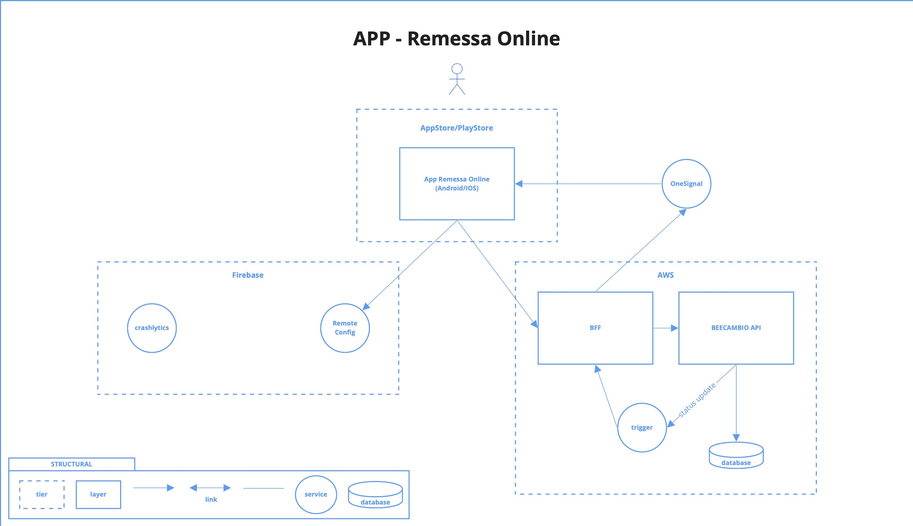

# Remessa Online (APP)

### Install, Run and Test
* [Installing flutter with FVM (Recommended)](https://fvm.app/docs/getting_started/installation)
> The project supports FVM, so after install (FVM), just run `fvm install`, to configure your IDE [check here](https://fvm.app/docs/getting_started/configuration)
* [Installing flutter default (Not Recommended)](https://flutter.dev/docs/get-started/install)
* [Running and Creating an App](https://flutter.dev/docs/get-started/test-drive?tab=terminal)
* [Tests](https://flutter.dev/docs/testing)

### [Project Structural MDL](https://miro.com/app/board/o9J_kvSpqGo=/)

> As you can see, we use a "BFF" as APP Backend, you can [check it](https://github.com/BeeTech-global/bee-bff-mobile)

### Remote Config
> We're using firebase

You can check our current remote configs, [here](https://console.firebase.google.com/u/0/project/bee-remessaonline/config).

### Push Notifications
> We're using OneSignal

You can access the console, [here](https://app.onesignal.com/apps/b2f1b437-2038-499a-8cd6-b22afe57daa9).

### Deploy
* [Build and release an Android app
](https://flutter.dev/docs/deployment/android)
* [Build and release an iOS app
](https://flutter.dev/docs/deployment/ios)

> Use our [Google Play Console](https://play.google.com/apps/publish/?account=5241723775526803116#AppDashboardPlace:p=br.com.remessaonline&appid=4976165735620278686) and [App Store Connect](https://appstoreconnect.apple.com/WebObjects/iTunesConnect.woa/ra/ng/app/1491830364)